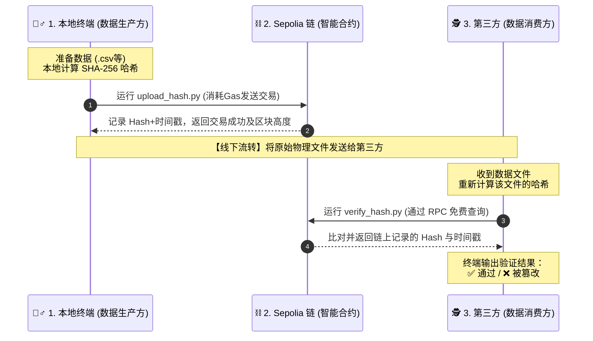

# 产品需求文档 (PRD)：GeoTrust 空间数据链上存证协议

> **项目状态**：🟢 MVP 阶段已跑通 (命令行原型验证)
**产品版本**：v1.0.0
**文档负责人**：张林果
**开源地址**：[[你的 GitHub 仓库链接]](https://github.com/zhanglinguo/geospatial-data-blockchain)
> 

---

## 一、 🌟 产品背景与愿景

### 1. 业务痛点

在 GIS（地理信息系统）与测绘数据流转中，数据通常作为高价值资产（如土地确权、农业定损、自动驾驶高精地图等）。但在传统的中心化存储模式下，面临以下痛点：

- **数据极易被篡改**：本地或中心化数据库（如 MySQL/OSS）管理员拥有最高权限，内部作恶篡改数据的风险高。
- **确权与溯源困难**：数据一旦发生交易或流转，接收方很难确认当前数据是否为原始的、未受污染的版本，缺乏带时间戳的权威存在证明。

### 2. 产品愿景

打造一个**去中心化、低成本、高隐私**的地理空间数据存证基础协议。通过将数据哈希上链，不泄露原始数据，利用区块链的不可篡改性，为 B 端测绘机构、政府监管部门和数据消费方提供“一键存证、免费验真”的信任基座。

---

## 二、 👥 目标用户与使用场景

| 用户角色 | 核心需求 | 典型使用场景 |
| --- | --- | --- |
| **数据生产方** *(如测绘院、飞手)* | 快速为刚采集的数据确权，锁定时间戳。 | 采集完一批 `elevation.csv` 数据后，立刻一键上传哈希上链，证明“我在这个时间点拥有这批原始数据”。 |
| **数据消费方** *(如企事业单位)* | 验证接收到的数据是否被篡改过。 | 收到合作方发来的数据，通过脚本比对链上哈希，确认数据完整且未被中途修改后再付款或入库。 |
| **审计/监管方** *(如司法机构)* | 需要客观、中立的证据链。 | 发生数据纠纷时，调取区块链上的时间戳和哈希记录作为不可抵赖的电子证据。 |

---

## 三、 🔄 核心业务流程

为了在 MVP 阶段以最小成本验证核心逻辑，当前版本采用 **CLI（命令行脚本）** 的交互方式，完整闭环如下：

---

## 四、 🛠 功能需求清单

### 1. 核心存证模块

作为产品的底层基建，智能合约（基于 Solidity）需提供以下核心接口：

- `storeHash(string hash)`：**写入接口**。接收 256 位哈希字符串，并与以太坊当前区块时间戳绑定存储。要求同一哈希不可重复覆盖。
- `getTimestamp(string hash)`：**读取接口**。输入已知哈希，返回链上记录的 10 位 Unix 时间戳。
- `exists(string hash)`：**验证接口**。输入已知哈希，返回布尔值（True/False），判断该哈希是否已在链上备案。

### 2. 客户端交互模块

- **⚙️ 配置管理 (`config.py`)**:
    - 支持用户配置私钥、RPC 节点地址（Infura）及合约地址。
    - 需具备安全防泄露机制（加入 `.gitignore`，严禁私钥上云）。
- **📤 数据上链功能 (`upload_hash.py`)**:
    - **本地哈希计算**：读取目标文件生成唯一数字指纹，**严格禁止直接上传明文文件**，以保护商业机密。
    - **交易广播**：签名并发送上链请求，需向用户展示交易 Hash 和等待确认状态。
- **🔍 防篡改验证功能 (`verify_hash.py`)**:
    - **状态反馈**：需明确输出两种状态判定：`✅ 未被篡改，上链时间:[转换后的可读时间]` 或 `❌ 数据已被篡改或未上链`。

---

## 五、 🛡️ 非功能需求与设计约束

1. **隐私与合规性要求**：采用“存储与验证分离”架构。链上**仅存证 Hash，绝对不上传物理文件**。即使链上数据全公开，也无法反推地理空间数据的内容，符合《数据安全法》等合规要求。
2. **成本控制策略（MVP）**：考虑到公链高昂的存储成本，MVP 阶段部署于以太坊 Sepolia 官方测试网，实现**开发、验证“零成本”跑通商业逻辑**。
3. **系统查询性能**：验证（读操作）通过 Infura 节点直接查询以太坊状态机，不涉及共识过程，需做到秒级响应且 0 Gas 费用。

---

## 六、 🗺️ 产品演进路线图

| 阶段 | 版本 | 核心目标 | 关键功能规划 |
| --- | --- | --- | --- |
| **Phase 1** | v1.0 *(当前)* | **MVP 逻辑验证** | Solidity 核心合约落地、Python 脚本跑通上链与验证闭环、跑通测试网。 |
| **Phase 2** | v1.5 | **前端化与体验升级** | 开发 React / Web3.js 前端页面（GUI），替代现有的命令行，支持浏览器连接 MetaMask 直接拖拽文件进行确权，降低小白使用门槛。 |
| **Phase 3** | v2.0 | **多链部署与降本** | 迁移至 Polygon/Arbitrum 等二层网络，实现主网环境下的极低手续费（单笔成本降至分级别）。 |
| **Phase 4** | v3.0 | **去中心化大文件存储** | 集成 IPFS (星际文件系统)，支持大体积（GB级）的 GIS 遥感影像原始文件的去中心化云端存储。 |